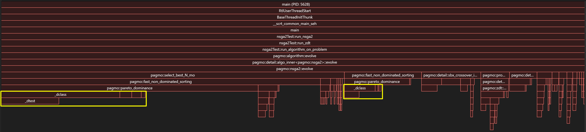
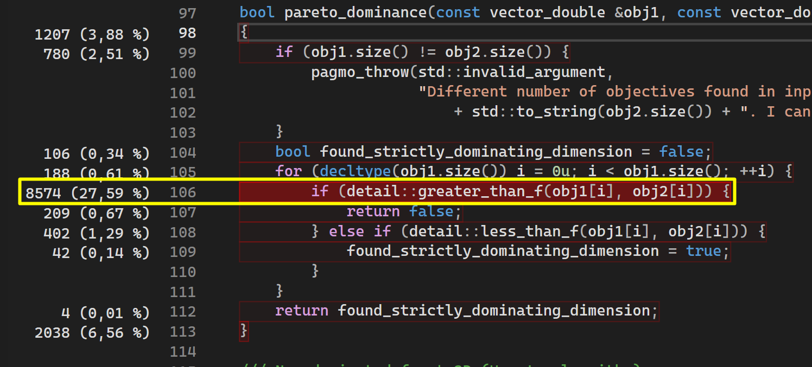
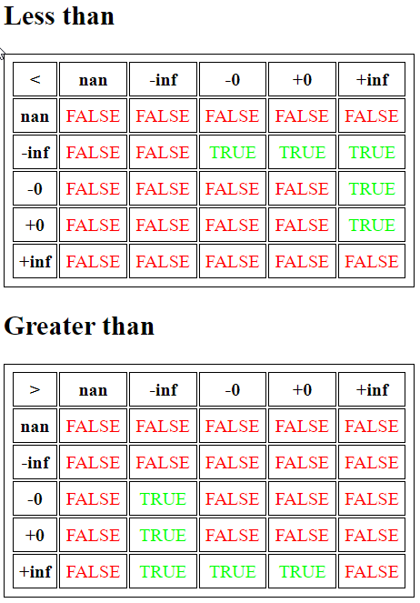
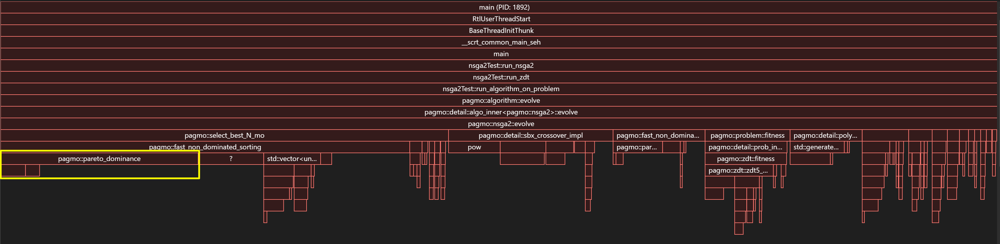
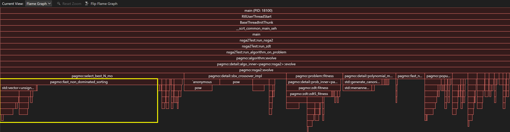
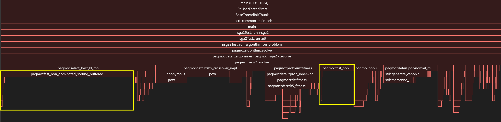
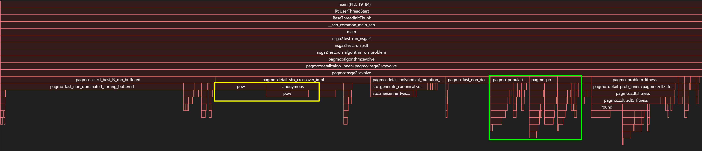
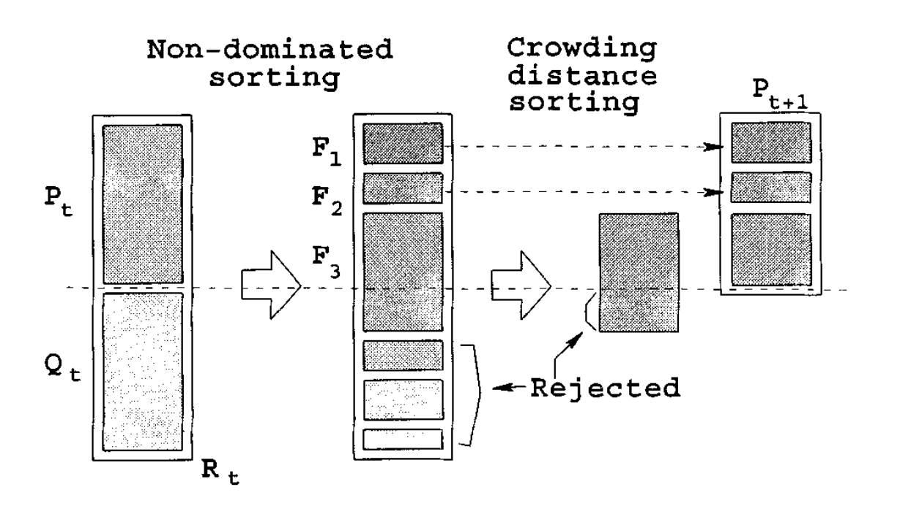

# Pagmo-NSGA2-Improve-Test

# Initialisation

After cloning, initialize git submodules by:

```
git submodule update --init --recursive
```

# Running the test

- Run CMake target "main"
- The main function runs the NSGA II algorithm on these test suites:
  - ZDT
  - DTLZ

- Population size is 100, generation count is 3500, as set in nsga2Test.h

# Performance Analysis

## The std::isnan problem

- Biggest performance bottleneck are functions `less_than_f` and  `greater_than_f` inside of `pagmo/detail/custom_comparisons.hpp`
- See highlighted portions of the images below:





- The inlined function `detail::greater_than_f` is a cause of significant slowdown in the hot path function `pareto_dominance()`, in total among all execution paths this function uses up about **35% of the total CPU time**
- Let's look at the body of this function:

```cpp
// Greater than compares floating point types placing nans after inf or before -inf
// It is a useful function when calling e.g. std::sort to guarantee a weak strict ordering
// and avoid an undefined behaviour
template <typename T, bool After = true>
inline bool greater_than_f(T a, T b)
{
    static_assert(std::is_floating_point<T>::value, "greater_than_f can be used only with floating-point types.");
    if (!std::isnan(a)) {
        if (!std::isnan(b))
            return a > b; // a > b
        else
            return !After; // a > nan
    } else {
        if (!std::isnan(b))
            return After; // nan > b
        else
            return false; // nan > nan
    }
}
```

- The flame graph above shows that calls to **_dclass** from **ucrtbase.dll** are what's taking up nearly all CPU time inside of this function
- What is **_dclass**? It's a Microsoft Runtime Library function which classifies if a floating point number is `NaN` (or something else)
  - https://learn.microsoft.com/en-us/cpp/c-runtime-library/reference/floating-point-primitives?view=msvc-170


- The functions `less_than_f` and `greater_than_f` are important to the Pagmo library because the default behavior of IEEE 754 logical operations on NaN is to always return false:
  
- https://stackoverflow.com/questions/71224184/ieee-754-floating-point-comparisons-with-special-cases
- Pagmo implements their own version of these operators to make sure that for example a valid double is always bigger than
`NaN`. We can see that in the pareto dominance function it ensures that an item which contains `NaN` won't "dominate" an item that contains only valid numbers.

## Solution
- We need to reduce the amount of calls to `std::isnan` as much as possible
- How? For example the C++20 spaceship operator is useful for this purpose, because it returns an instance of `std::partial_ordering` 
  - https://en.cppreference.com/w/cpp/utility/compare/partial_ordering.html
- If one of the operands is `NaN` it causes std::partial_ordering::unordered to be returned
- See commit history for how this was implemented
- This change alone resulted in a **30% performance increase**, reducing the execution time **from 33.9 seconds to 23.61 seconds**



# Significant function call overhead in hot path loops

- The function `pareto_dominance` is **not declared as inline**
- This turns out to be another cause of significant performance degradation, especially due to the for loop in `fast_non_dominated_sorting()`
- Making this function inline further improves execution time to **18.292 seconds (46% improvement over baseline 33.9 seconds)**



# Possible further optimization of pareto_dominance()

- This functions calls both `greater_than_f` and `less_than_f` in a loop, which means that we could optimize it further by entirely removing these calls and writing custom logic using the spaceship operator directly
- This could prevent a second evaluation of the spaceship operator by `less_than_f`, however in practice it didn't cause any measurable performance improvements

```cpp
bool pareto_dominance(const vector_double &obj1, const vector_double &obj2)
{
    if (obj1.size() != obj2.size()) {
        pagmo_throw(std::invalid_argument,
                    "Different number of objectives found in input fitnesses: " + std::to_string(obj1.size()) + " and "
                        + std::to_string(obj2.size()) + ". I cannot define dominance");
    }
    bool found_strictly_dominating_dimension = false;
    for (decltype(obj1.size()) i = 0u; i < obj1.size(); ++i) {
#if defined(__cpp_impl_three_way_comparison)
        auto cmp = obj1[i] <=> obj2[i];
        if (cmp == std::partial_ordering::greater) {
            return false;
        }

        if (cmp == std::partial_ordering::less) {
            found_strictly_dominating_dimension = true;
            continue;
        }

        // Handle possible NaN situations
        if (cmp == std::partial_ordering::unordered) {
            const bool obj1_nan = std::isnan(obj1[i]);
            const bool obj2_nan = std::isnan(obj2[i]);

            // greater_than_f returns true if A is NaN and B is valid double, do the same thing as original code
            if (obj1_nan && !obj2_nan) {
                return false;
            }

            // less_than_f returns true if B is NaN and A is valid double, do the same thing as original code
            if (!obj1_nan && obj2_nan) {
                found_strictly_dominating_dimension = true;
            }
        }

# else

        // Pre-C++20 implementation
        if (detail::greater_than_f(obj1[i], obj2[i])) {
            return false;
        } else if (detail::less_than_f(obj1[i], obj2[i])) {
            found_strictly_dominating_dimension = true;
        }

# endif
    }
    return found_strictly_dominating_dimension;
}
```

# Vectors allocating memory in hot path functions

- The function `fast_non_dominated_sorting` has several vectors defined as automatic (on-stack) variables:

```cpp
fnds_return_type fast_non_dominated_sorting(const std::vector<vector_double> &points)
{
auto N = points.size();
// We make sure to have two points at least (one could also be allowed)
if (N < 2u) {
pagmo_throw(std::invalid_argument, "At least two points are needed for fast_non_dominated_sorting: "
+ std::to_string(N) + " detected.");
}
// Initialize the return values
std::vector<std::vector<pop_size_t>> non_dom_fronts(1u);
std::vector<std::vector<pop_size_t>> dom_list(N);
std::vector<pop_size_t> dom_count(N);
std::vector<pop_size_t> non_dom_rank(N);

    // Start the fast non dominated sort algorithm
    for (decltype(N) i = 0u; i < N; ++i) {
        dom_list[i].clear();
        dom_count[i] = 0u;
        for (decltype(N) j = 0u; j < i; ++j) {
            if (pareto_dominance(points[i], points[j])) {
                dom_list[i].push_back(j);
                ++dom_count[j];
            } else if (pareto_dominance(points[j], points[i])) {
                dom_list[j].push_back(i);
                ++dom_count[i];
            }
        }
    }
    for (decltype(N) i = 0u; i < N; ++i) {
        if (dom_count[i] == 0u) {
            non_dom_rank[i] = 0u;
            non_dom_fronts[0].push_back(i);
        }
    }
    // we copy dom_count as we want to output its value at this point
    auto dom_count_copy(dom_count);
    auto current_front = non_dom_fronts[0];
    std::vector<std::vector<pop_size_t>>::size_type front_counter(0u);
    while (current_front.size() != 0u) {
        std::vector<pop_size_t> next_front;
        for (decltype(current_front.size()) p = 0u; p < current_front.size(); ++p) {
            for (decltype(dom_list[current_front[p]].size()) q = 0u; q < dom_list[current_front[p]].size(); ++q) {
                --dom_count_copy[dom_list[current_front[p]][q]];
                if (dom_count_copy[dom_list[current_front[p]][q]] == 0u) {
                    non_dom_rank[dom_list[current_front[p]][q]] = front_counter + 1u;
                    next_front.push_back(dom_list[current_front[p]][q]);
                }
            }
        }
        ++front_counter;
        current_front = next_front;
        if (current_front.size() != 0u) {
            non_dom_fronts.push_back(current_front);
        }
    }
    return std::make_tuple(std::move(non_dom_fronts), std::move(dom_list), std::move(dom_count),
                           std::move(non_dom_rank));
}
```

- This causes these vectors to be repeatedly constructed and destructed between calls, resulting in useless re-allocation of memory
- According to VS Profiler, this takes about 7% of total CPU time
- Solution was to add the following function:
``` cpp
void fast_non_dominated_sorting_buffered(const std::vector<vector_double> &points, fnds_return_type& sorting_results)
```
- Which allows user to pass `sorting_results` as one of the parameters, allowing already allocated memory to be reused
- This reduced the execution time to **16.783 seconds**, which is about **50% improvement over the baseline (33.9 seconds)**



# Other memory allocations

- There are several vectors defined elsewhere, mainly inside NSGA2's `evolve()` function
- An attempt was made to move as much of these definitions outside of NSGA2's loop, however no noticeable improvement was measured
- See commit history for details

# Remaining bottlenecks
- The two remaking bottlenecks of the NSGA2 implementation are:
  - Calls to `std::pow`
  - Various memory copy operations inside NSGA2's evolve loop
- `std::pow` seems to be unreasonably inefficient for the parameters that this algorithm is using, only solution would be to implement a custom `pow` function or use some other library implementation
- As for the memory copy operations, it seems that it's impossible to improve anything without introducing major changes to the algorithm itself



# NSGA II

NSGA2 has these following features:
- **Multi-objective**
  - Accepts problems with multiple objective functions
  - Searches for approximate "Pareto front" of optimal solutions, where improving one objective functions worsens another objective function

- **Unconstrained**
  - Algorithm designed for unconstrained problems
  - So for example having constraint expressions like: $e(x) < 0$, where $x$ is an individual of the population are not supported

- **Integer programming**
  - Supports problems where individual of the population consists of discrete integer values, instead of vectors of double



## NSGA II Steps

1. **Initialize**  
   Generate population $P_0$ of size $N$ and evaluate objectives

2. **Non-dominated sorting**  
   Split $P_t$ into Pareto fronts $F_1, F_2, \dots$ by dominance rank

3. **Crowding distance**  
   Compute crowding distance within each front to preserve diversity

4. **Selection**  
   Binary tournament:
    - Prefer lower rank
    - If equal rank, prefer higher crowding distance

5. **Variation**  
   - Apply crossover and mutation to create offspring $Q_t$ (size $N$)
   - Evaluate $Q_t$

6. **Elitist merge**  
   - Form $R_t = P_t \cup Q_t$ (size $2N$)
   - Sort $R_t$ into fronts

7. **Next generation**  
   - Fill $P_{t+1}$ with best fronts
   - If a front overflows, select by descending crowding distance

8. **Repeat**  
   Stop when termination criterion is met
